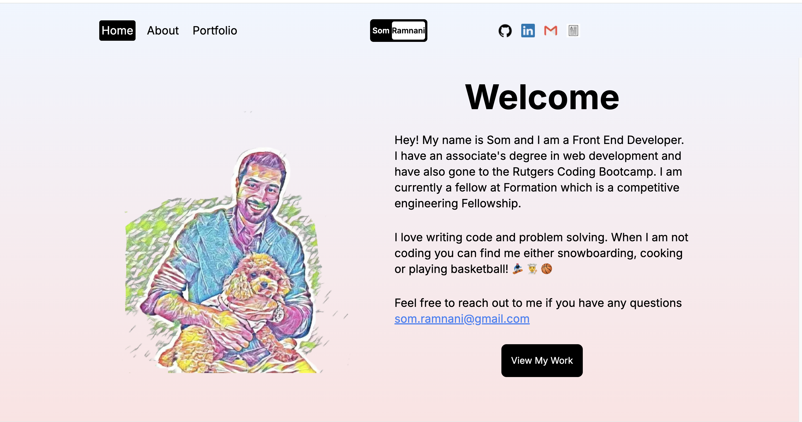

# Som's Portfolio


Portfolio site built with Next.js and TailwindCSS. Visit here: https://www.somramnani.com/



## 🛠️ Technologies

- Node.js
- Next.js
- TailwindCSS
- Vercel

## Getting Started

First, run the development server:

```bash
npm run dev
# or
yarn dev
# or
pnpm dev
# or
bun dev
```
