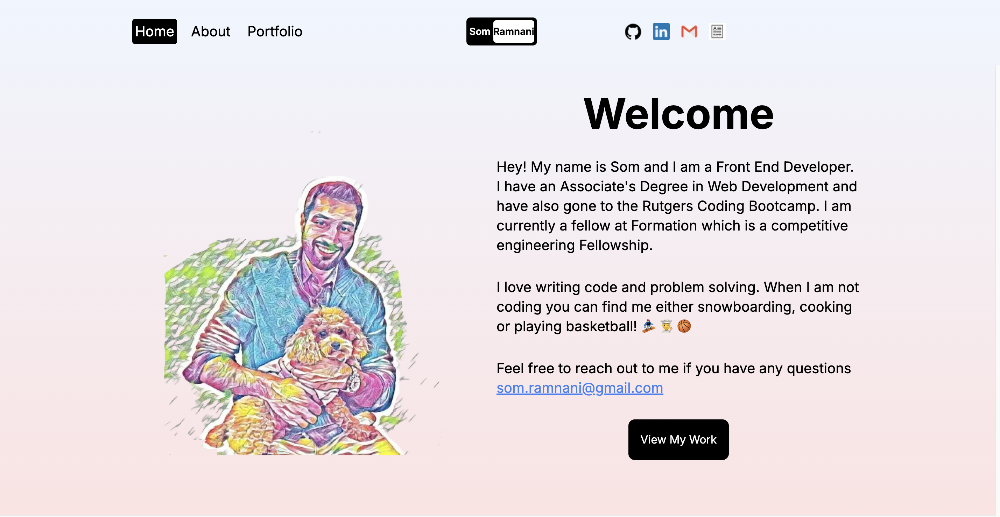

# Som's Portfolio


Portfolio site built with Next.js and TailwindCSS. Visit here: https://www.somramnani.com/



## 🛠️ Technologies

- Next.js
- TailwindCSS
- Vercel

## ✨ Features

- Smooth scroll navigation
- Animated project cards with Framer Motion
- Responsive layout for mobile and desktop
- Project showcase section

## 🎯 Lighthouse Score


## 🚀 Getting Started

Clone the repo:

```bash
git clone https://github.com/somramnani/next-portfolio
cd next-portfolio
```

Install dependencies

```bash
npm install
```

Start the development server

```bash
npm run dev
```

Visit: http://localhost:3000
